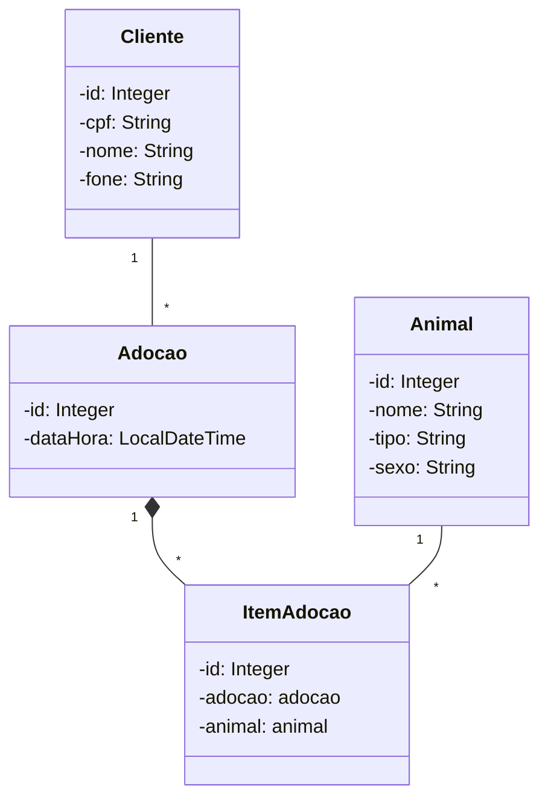

exemplo-dao-spring-jpa-com_associacoes-ui-completa
==================================================

Exemplo de aplicação JPA com Spring Boot e Spring Data JPA.

A aplicação possui menus e sub-menus para cadastro de clientes, produtos, compras e itens de compras.

